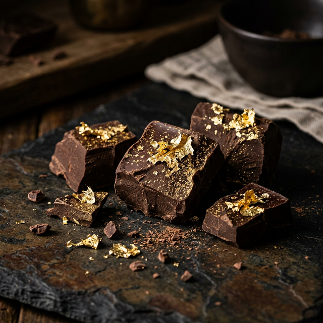
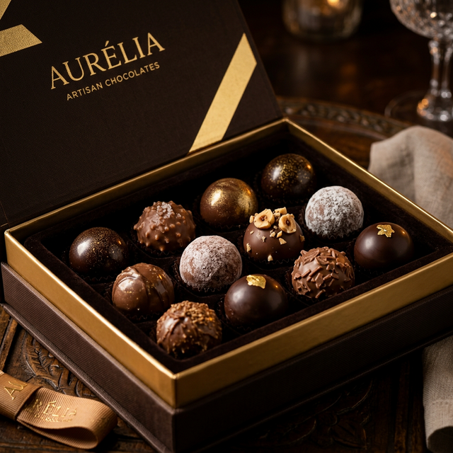
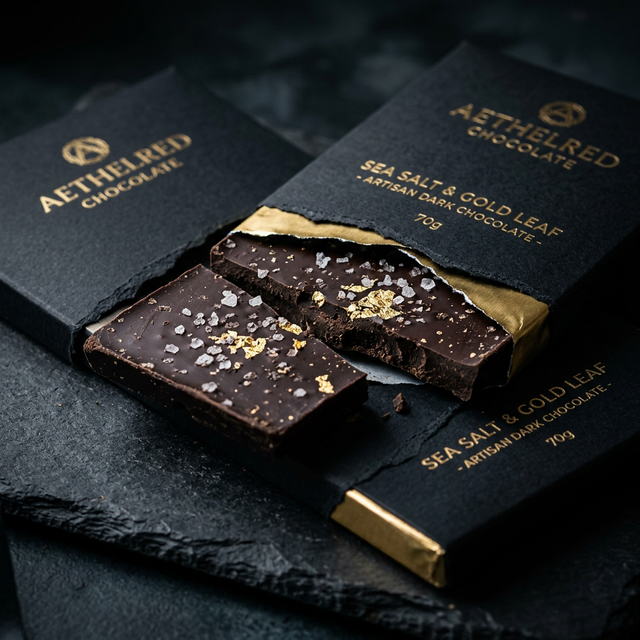
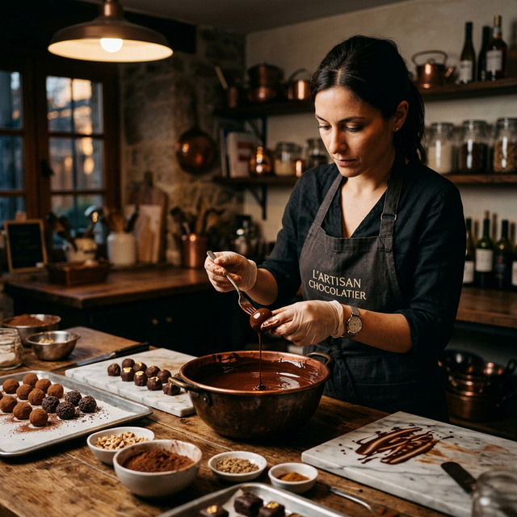

# Luxe Noir - Premium Artisan Chocolate

A perfectly responsive, production-ready landing page for a luxury artisan chocolate brand. Built with a focus on deep aesthetics, pixel-perfect fluid layouts, and buttery-smooth accessibility across all screens.

## 📸 Screenshots

### Desktop View / Hero Section

### The Signature Collection

  
  
  
  

### Craftsmanship & Features

*(Note: Replace the images above with full-page screenshots if you wish to showcase the entire page layout!)*

---

## 🌟 Key Features

### 🌖 Intelligent Dual Theming (Dark & Light)
- **Dark Theme:** Deep, cinematic `rgba(14, 14, 16)` background paired with brilliant gold (`#D4AF37`) accents. Text shadows and overlays maximize the luxurious feel.
- **Light Theme:** Elegant, breathable off-white (`#F8F5EF`) design tailored to daylight readability. 
- *Note:* The hero cinematic video section intrinsically maintains the deep styling for an everlasting premium first impression on load, regardless of the active theme!

### 📱 Flawless Mobile Responsiveness
Engineered to look gorgeous on every modern device, perfectly framing up tight on a 320px iPhone SE and smoothly interpolating up to wide 1920px screens.
- **Fluid Typography:** Base typography transitions seamlessly, with rigid outer boundaries enforced via media queries.
- **Dynamic CSS Grids:** Layout drops elegantly from 4 columns (Desktop) → 3 columns (Laptop) → 2 columns (Tablet) → 1 column (Mobile).
- **Accessible Touch Targets:** The collapsed hamburger navigation menu, CTA buttons, and links strictly enforce an accessible minimum `44px` height on mobile.

### 📐 Breakpoint Architecture
- **Desktop:** `1281px+`
- **Laptop:** `769px - 1280px`
- **Tablet:** `481px - 768px`
- **Mobile Large:** `376px - 480px`
- **Mobile Small:** `320px - 375px`

## 🛠️ Tech Stack & Standards
- **HTML5:** 100% semantic markup (`<header>`, `<main>`, `<article>`, `<section>`, `<footer>`) maximizing accessibility and SEO.
- **Vanilla CSS3:** Driven entirely by deeply structured CSS Custom Variables (`:root`), Flexbox, CSS Grid, and zero external framework bloat.
- **A11y (Accessibility):** Fully respects user OS motion preferences via `@media (prefers-reduced-motion: reduce)`, instantly pausing background videos and disabling animations for affected users.

## 🚀 Getting Started

1. Clone or download this repository.
2. Open `index.html` in your favorite web browser (or serve it through a local live server, e.g., VS Code Live Server). 
3. *No build tools, dependency installations, or configurations are required.*

Enjoy the ultimate artisan chocolate experience! 🍫
